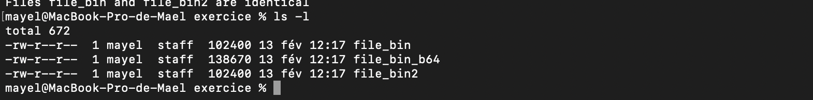
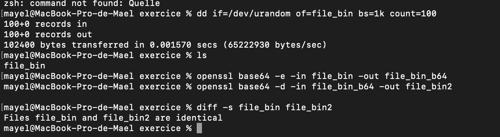
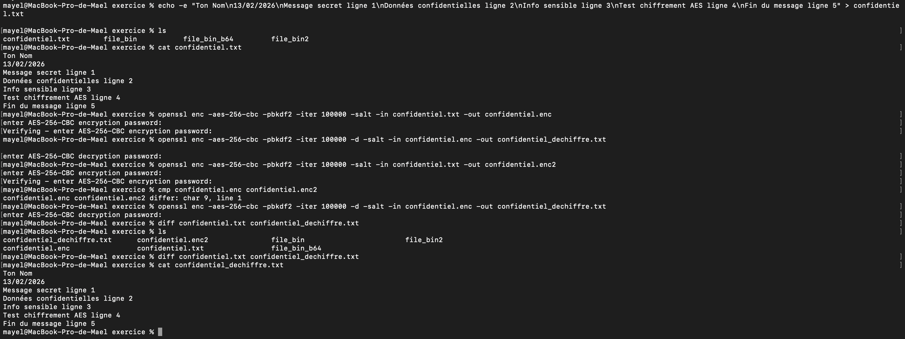
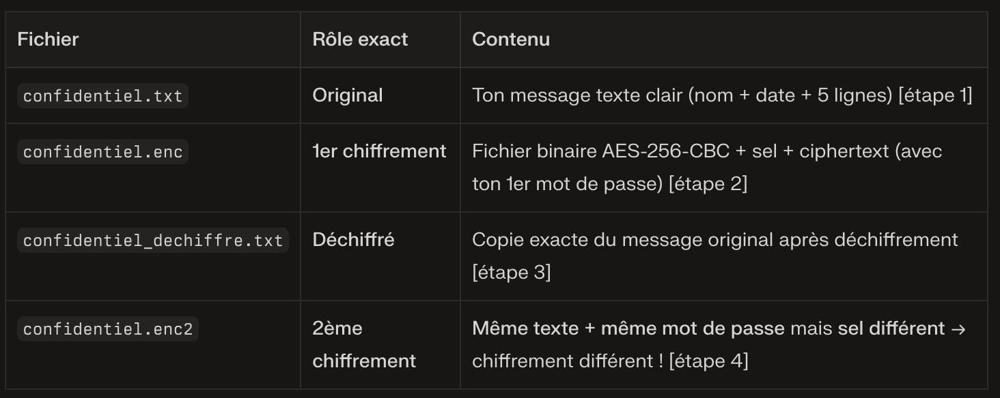
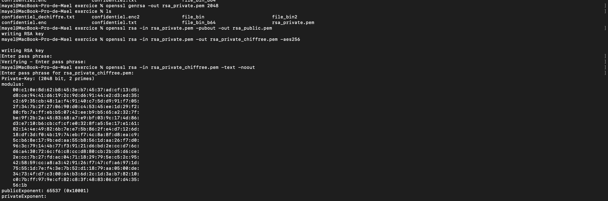
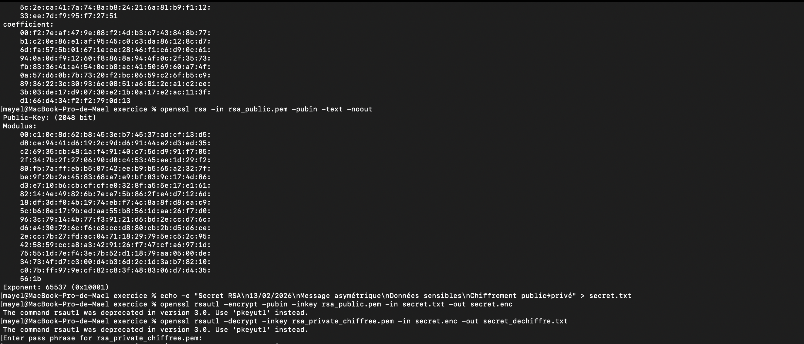
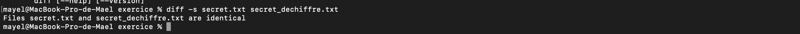
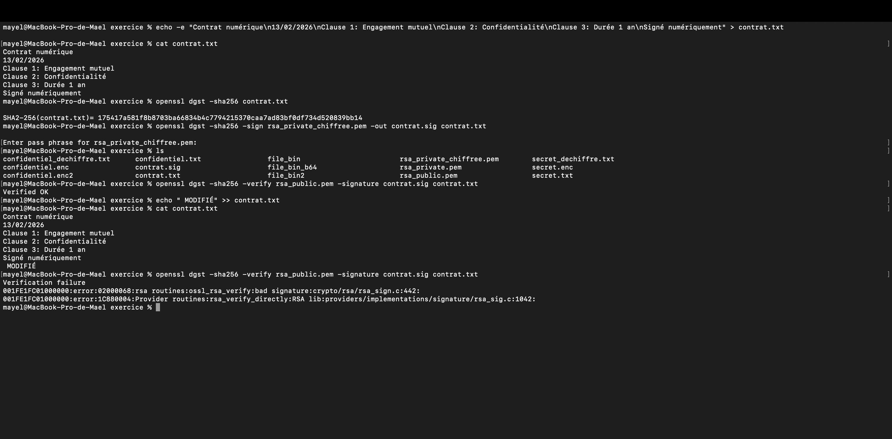

# B1 Linux - TP3

## II. Sans que je vous file les réponses à chaques étapes

### A. Base64

1. Non, Base64 n'est pas un chiffrement. C'est un simple encodage qui convertit des données binaires en une chaîne de caractères ASCII lisibles, sans aucune protection contre la lecture ou la modification.

2. La taille d'un fichier augmente après encodage Base64 car ce processus convertit 3 octets binaires (24 bits) en 4 caractères ASCII (24 bits aussi, mais chacun codé sur 8 bits).

3. L'augmentation approximative de la taille d'un fichier après encodage Base64 est de 33%.

4. avec la commande

   diff -s [file 1 ] [file 2]

qui vas venire différencer en tout point les deux fichirers selectionner si on fait ca sur deux fichiers 1 qui contient 100ko de données aleatoire quon encode puis decode en base64 cette comande nous retournera que nos deux fichier ont identique.

### B. Chiffrement symétrique – AES

1. Le sel (-salt) change à chaque exécution : c'est une valeur aléatoire unique préfixée dans chaque fichier .enc. Même mot de passe + même texte → sels différents → clés dérivées différentes → chiffrement différent.

2. Empêche les attaques par tables rainbow (précalculs) et assure que deux utilisateurs avec le même mot de passe aient des clés différentes. Sans sel, même mot de passe = même clé = chiffrement identique.

3. Échec total : bad decrypt ou wrong final block length. AES-CBC est strict – IV/sel/iter/mode dérivés doivent être identiques exactement.

4. Transforme un mot de passe faible en clé cryptographique forte via :

Milliers d'itérations (ici 100k) pour ralentir les attaques GPU/ASIC (key stretching)

HMAC-SHA256 sécurisé

Sel pour unicité
Sans PBKDF2, un mot de passe direct serait vulnérable à la force brute rapide.

5. Encodage (Base64) : réversible publiquement, transforme données binaires→texte (↑33% taille), aucune sécurité. Chiffrement (AES) : nécessite clé secrète, rend illisible/confus, sécurisé contre lecture.

### C. Cryptographie asymétrique – RSA

1. Permet déchiffrement de tout ce qui a été chiffré avec la publique + signatures. Partagée = tout compromis !

2. Lent (exp exponentielle) + limité à ~245 octets par bloc (2048 bits). AES symétrique 1000x plus rapide pour données volumineuses.

3. Différences paramètres pub/priv ?

Publique : modulo
n
=
p
×
q
n=p×q, exposant public
e
e (souvent 65537)

Privée : + exposant privé
d
d, premiers
p
,
q
p,q, coefficients. Pub = subset de privée.

Rôle du modulo ?
n
=
p
×
q
n=p×q (produit 2 grands premiers). Espace de chiffrement ; connaît
n
n sans
p
,
q
p,q = casse RSA impossible.

4. RSA échange clé AES (256 bits) rapidement ; AES chiffre le gros fichier vite/sécurisé. Hybridation : RSA asymétrique + AES symétrique.

### D. Signature numérique

1. comme l'on peut le voir apres modification du fichier la clef retourne une erreur (verification failure) La signature ne correspond plus au nouveau hash.

2. Nouveau hash différent (même 1 octet changé → hash totalement différent), Signature = hash chiffré avec clé privée, Vérification recalcule hash + déchiffre signature → hashS ≠ hashN → refus

3. Réduit document (GoT → 32 octets SHA256), Fixe l'intégrité (changement → nouveau hash), RSA rapide (256 bits vs mégaoctets),Détecte toute altération

4. | Signature                       | Chiffrement                         |
   | ------------------------------- | ----------------------------------- |
   | Prouve l'auteur                 | Cache le contenu                    |
   | Privée signe → Publique vérifie | Publique chiffre → Privée déchiffre |
   | Authentifie + Intégrité         | Confidentialité                     |
   | Hash chiffré                    | Données chiffrées                   |
