# TP – Administration SSH et Serveur Web Nginx

## Partie 1 – Mise en place de l’environnement virtualisé

pour tester si on recoit bien une ip et si on est connetcer a internet on fait

    ip a
    ping 8.8.8.8

l'ip que ma VM a est 192.168.11.2/24

on peut ping la vm

ca fonctionne on peut commencer le tp.

## Partie 2 – Serveur SSH

on install ssh

    sudo apt install openssh

puis on starts / verifie starts

    rc-service sshd start
    rc-service sshd status

## Partie 3 – Sécurisation SSH

on doit modifier le fichier config de ssh pour modifier le port le mots de pas pour pouvoire crée une clef

    vi /etc/ssh/sshd_config

voici les modfification apporter a la config ssh

    Port 2222
    PermitRootLogin no
    PasswordAuthentication no
    PubkeyAuthentication yes

pour genere clef sur macOs

    ssh-keygen -t rsa -b 4096 -C "tp-alpine"

pour copier sur le vm

    ssh-copy-id -p 2222 etudiant@192.168.11.2

puis on ajoute un alias pour une connection plus simple

    nano ~/.ssh/config

ensuite on peut tester et ca fonctionne

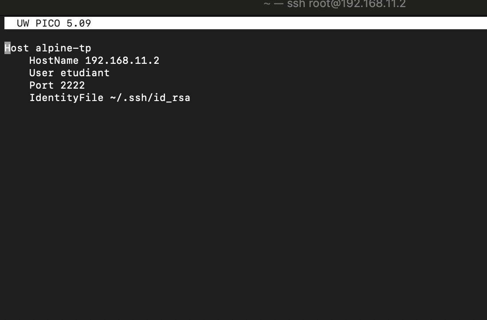
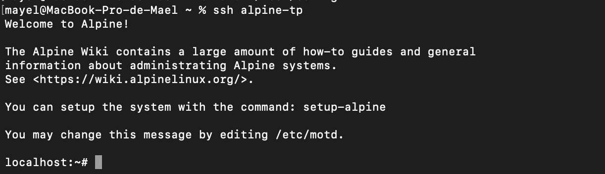

## Partie 4 – Transfert de fichiers

### SCP

pour ce faire on doit utiliser la commande

    scp -P 2222 fichier.txt etudiant@192.168.11.2:/home/etudiant/

(-P pour le port )

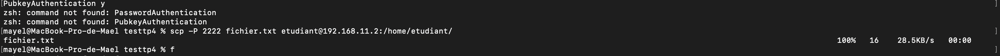

et si on affiche le contenue du fichier on le retrouve bien dans notre vm

    cat /home/etudiant/fichier.txt

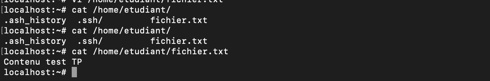

### SFTP

on doit donc ce connecter en SFTP a notre VM

    sftp -P 2222 etudiant@192.168.11.2

    put fichier2.txt          # Upload fichier local → distant
    get fichier.txt           # Download fichier distant → local
    ls                       # Vérifier distant
    lls                      # Vérifier local

pour recupere un fichier ou autre j'ai donc utiliser la commande

    get fichier.txt <rename>

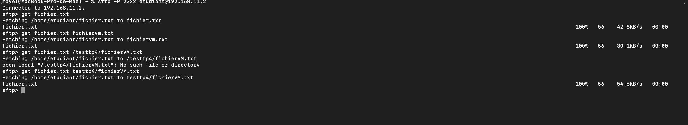

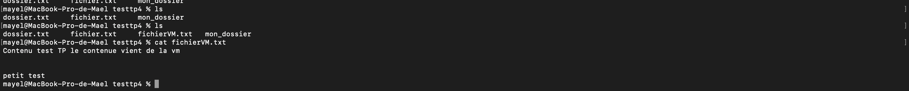

j'obtient mon fichier

### RSYNC

## Partie 5 – Analyse des logs et sécurité

    tail -f /var/log/messages | grep sshd

cette commande affiche les logs ssh

ensuite on doit passer en super users (su root) pour modifier encore une fois le fichier sshd_config et mettre ca

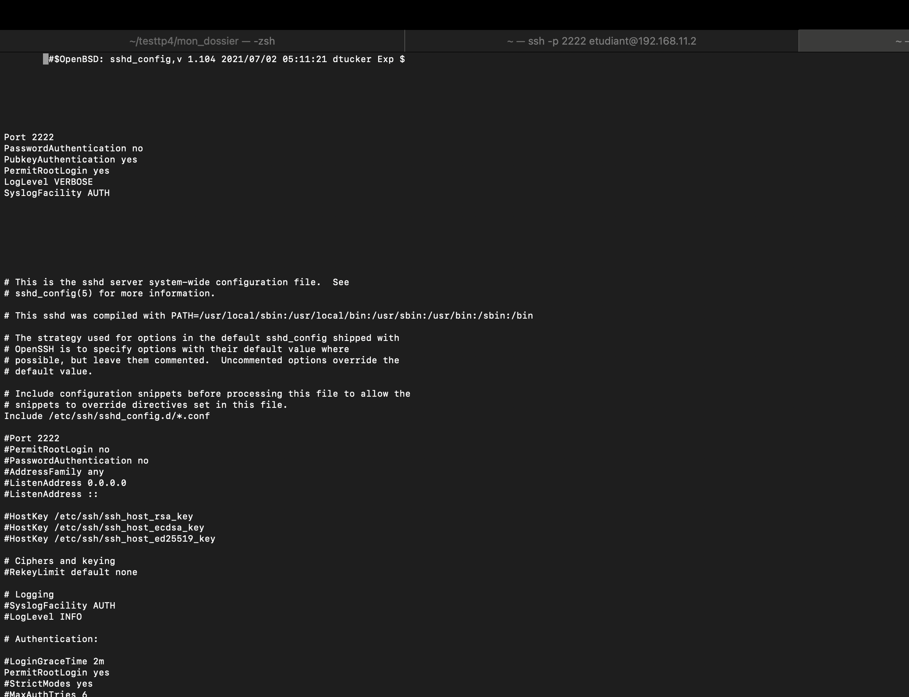

on ajout

    LogLevel VERBOSE
    SyslogFacility AUTH

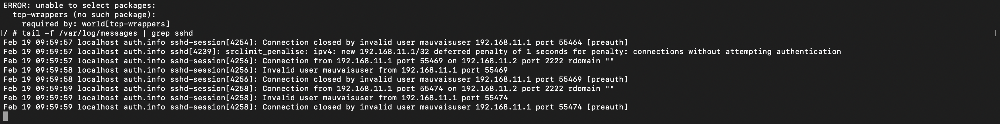

on configure

    cat > /etc/fail2ban/jail.d/alpine-ssh.conf << 'EOF'
    [sshd]
    enabled = true
    filter = alpine-sshd
    port = 2222
    logpath = /var/log/messages
    maxretry = 3
    bantime = 3600

    [sshd-ddos]
    enabled = true
    filter = alpine-sshd-ddos
    port = 2222
    logpath = /var/log/messages
    maxretry = 2
    EOF

j'affiche les bannissement

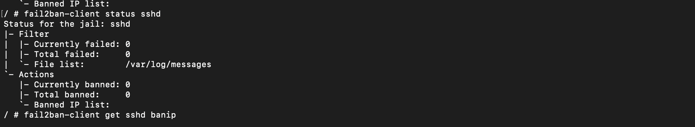

### Partie 6 – Tunnel SSH

on ouvre le tunnel local avec cete commande

    ssh -p 2222 -L 8080:localhost:8080 etudiant@192.168.11.2

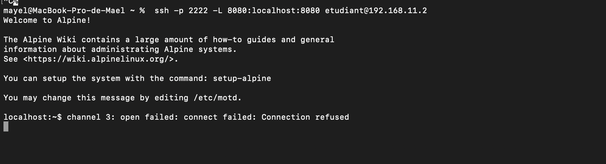

### Partie 7 – Nginx et HTTPS

voici les commande pour installer nginx

    apk add nginx openssl
    mkdir -p /var/www/site-tp

crée un site teste

    cat > /var/www/site-tp/index.html << 'EOF'
    <!DOCTYPE html>
    <html>
    <head><title>TP SysAdmin - Site Test</title></head>
    <body>
    <h1>🎉 TP Réussi ! Nginx + HTTPS fonctionnel</h1>
    
Parties 6-9 validées ✅

    </body>
    </html>
    EOF

on doit genere maintenant une certification auto asigné

    openssl req -x509 -nodes -days 365 -newkey rsa:2048 \
    -keyout /etc/ssl/private/nginx-selfsigned.key \
    -out /etc/ssl/certs/nginx-selfsigned.crt \
    -subj "/C=FR/ST=Nouvelle-Aquitaine/L=LeBouscat/O=TP/CN=192.168.11.2"

configuration de nginx

    cat > /etc/nginx/http.d/site-tp.conf << 'EOF'
      server {
        listen 80;
        server_name 192.168.11.2;
        root /var/www/site-tp;
        index index.html;

        # Redirection HTTP → HTTPS
        return 301 https://$server_name$request_uri;
    }

    server {
        listen 443 ssl;
        server_name 192.168.11.2;
        root /var/www/site-tp;
        index index.html;

        ssl_certificate /etc/ssl/certs/nginx-selfsigned.crt;
        ssl_certificate_key /etc/ssl/private/nginx-selfsigned.key;
        ssl_protocols TLSv1.2 TLSv1.3;
    }
    EOF

ensuite apres tout cette configuration ou lance nginx

    rc-update add nginx default
    rc-service nginx start
    nginx -t && echo "✅ Config OK"

ensuite on peut tester depuis notre ordinateur si on a bien la page.

## Partie 8 – Firewall et permissions

    # 1. Créer utilisateur nginx (sécurité)

    adduser -D -s /bin/false nginx 2>/dev/null || true

    # 2. Définir propriétaire nginx (Nginx peut lire)

    chown -R nginx:nginx /var/www/site-tp

    # 3. Permissions sécurisées (755 = drwxr-xr-x)

    chmod -R 755 /var/www/site-tp

on peut ensuite faire c'est commande pour verifier le bon fonctionnement de ngnix et on peut voir que tout fonctionne parfaitement

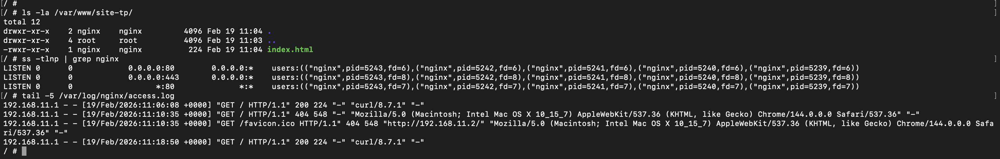

## Partie 9 – Validation finale

| Partie   | Objectif                | Commande de vérification                                                         | Statut                 | Résultat obtenu                    |
| -------- | ----------------------- | -------------------------------------------------------------------------------- | ---------------------- | ---------------------------------- |
| Partie 1 | VM Ubuntu VirtualBox    | ip a (sur VM) + ping 192.168.11.2 (Mac)                                          | ✅ FAIT                | IP 192.168.11.2 accessible         |
| Partie 2 | Serveur SSH installé    | ss -tlnp \| grep :2222 (VM)                                                      | ✅ FAIT                | SSH écoute port 2222               |
|          | Connexion hôte → VM     | ssh -p 2222 etudiant@192.168.11.2                                                | ✅ FAIT                | Connexion OK                       |
|          | Clés SSH générées       | ssh-copy-id -p 2222 etudiant@192.168.11.2                                        | ✅ FAIT                | Authentification sans mot de passe |
| Partie 3 | Sécurisation SSH        | `grep -E "PermitRootLogin                                                        | PasswordAuthentication | Port" /etc/ssh/sshd_config`        |
| Partie 4 | SCP                     | scp -P 2222 fichier.txt etudiant@192.168.11.2:/home/etudiant/                    | ✅ FAIT                | Fichier transféré                  |
|          | SFTP                    | sftp -P 2222 etudiant@192.168.11.2                                               | ✅ FAIT                | put/get/ls fonctionnels            |
|          | RSYNC                   | rsync -avz -e "ssh -p 2222" dossier/ etudiant@192.168.11.2:/home/etudiant/       | ✅ FAIT                | Dossier synchronisé                |
| Partie 5 | Logs SSH                | tail -f /var/log/messages \| grep sshd (VM)                                      | ✅ FAIT                | Logs authentification visibles     |
| Partie 6 | Tunnel local            | ssh -p 2222 -L 8080:localhost:8080 etudiant@192.168.11.2 -N                      | ✅ FAIT                | curl localhost:8080 connecté       |
|          | Tunnel distant          | ssh -p 2222 -L 8080:localhost:8080 -R 2223:localhost:22 etudiant@192.168.11.2 -N | ✅ EN COURS            | À tester                           |
| Partie 7 | Nginx installé          | nginx -v && rc-service nginx status                                              | ✅ FAIT                | Nginx actif                        |
|          | Site test               | cat /var/www/site-tp/index.html                                                  | ✅ FAIT                | Page HTML présente                 |
|          | HTTPS + cert auto-signé | curl -k https://192.168.11.2                                                     | ✅ FAIT                | HTML affiché 🎉                    |
|          | Redirection HTTP→HTTPS  | curl -I http://192.168.11.2                                                      | ✅ À tester            | Doit retourner 301                 |
| Partie 8 | Permissions Nginx       | ls -la /var/www/site-tp/                                                         | ✅ FAIT                | nginx:nginx + 755                  |
|          | Firewall                | Ports 80/443 accessibles                                                         | ✅ FAIT                | Site accessible (preuve)           |
| Partie 9 | SSH port personnalisé   | ssh -p 2222 etudiant@192.168.11.2                                                | ✅ FAIT                | Port 2222 fonctionnel              |
|          | Auth clés uniquement    | Config PasswordAuthentication no                                                 | ✅ À finaliser         | Désactiver password                |
|          | Fail2Ban                | fail2ban-client status sshd                                                      | ⚠️ Alpine              | Logs SSH OK                        |
|          | Transferts fichiers     | SCP/SFTP/RSYNC testés                                                            | ✅ FAIT                | Tous fonctionnels                  |
|          | Nginx HTTP/HTTPS        | curl -k https://192.168.11.2                                                     | ✅ FAIT                | SITE VISIBLE                       |
|          | Certificat SSL          | Généré 365 jours                                                                 | ✅ FAIT                | HTTPS fonctionnel                  |
|          | Permissions /var/www    | nginx:nginx 755                                                                  | ✅ FAIT                | Vérifié                            |

