# TP5 : pfSense – Bases d’un pare-feu

ce tp a étais fait en duo **Mathis dupré**

## Partie 1 – Prise en main et sécurisation

### 1. Accès à l’interface

1.+2.
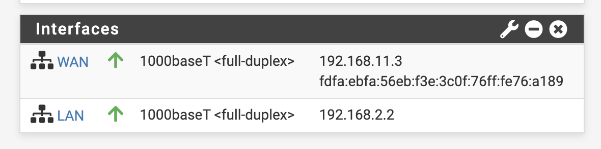

3. HTTPS => S pour Sécuriser

   HTTPS permet :

   Chiffrement des données,
   Protection contre l’interception des identifiants,
   Protection contre le MITM (attaque homme du milieu)

4. car les identifiant par defaut d'un pare-feu sont connue de tous accessible en 1 recherche sur google tout le monde les connais donc il faut les changer.

### 2. Sécurisation de l’accès administrateur

1. Acceuil>Systeme>User manager

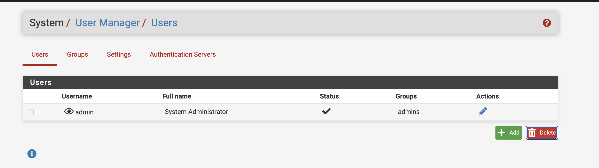

2. Un mot de passe robuste :
   Minimum 12–14 caractères,
   Majuscules,
   Minuscules,
   Chiffres,
   Caractères spéciaux,
   Pas de mot du dictionnaire,
   Pas d’information personnelle,

3. Parce que l’administrateur peut :
   Modifier les règles firewall,
   Ouvrir des ports,
   Désactiver la sécurité,
   Espionner le trafic,
   Couper Internet
   c'est une faille de securiter qui ce doit d'etre corriger

## Partie 2 – Comprendre les interfaces réseau

### 3. Vérification des interfaces

1. c'est l'interface WAN (Wide Area Network)

2. c'est l'interface LAN pour Local (Local Area Network)

3. Conséquences graves :
   Interface LAN exposée à Internet
   Accès admin depuis l’extérieur
   Règles firewall inversées
   Perte de connectivité

## Partie 3 – Configuration des services réseau

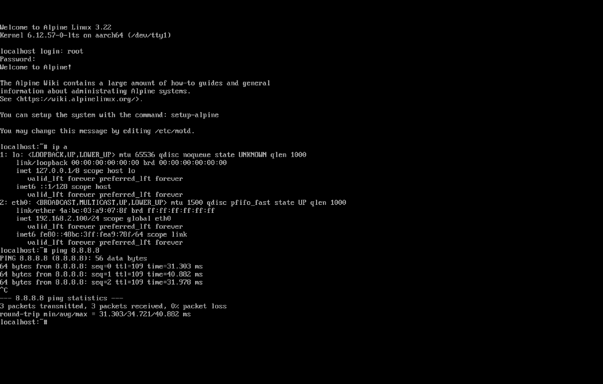
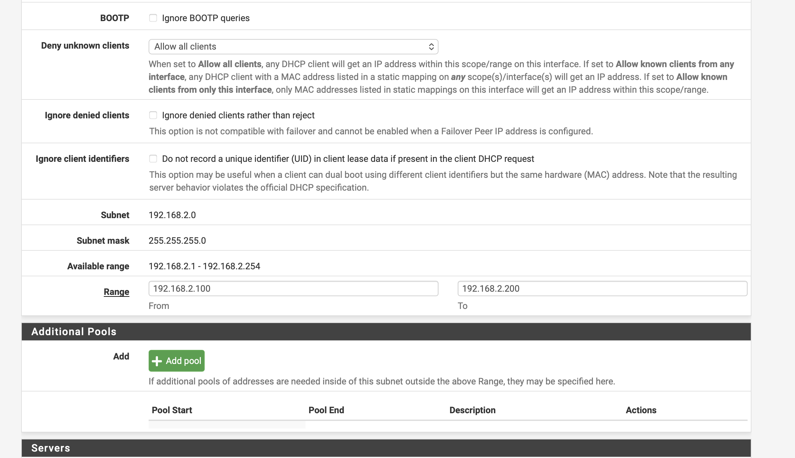

j'ai tester tout les ping fonctionne en Local

### 4. DHCP

1. un service DHCP est un protocole qui atribut automatiquement une ip a chaque machine qui se connecte au réseaux.

2. il faut choisir un plage d'adressage qui exclu les ip fixe, et qui inclu un nombr suffitsant d'addresse pour l'utilisation du réseaux

3. les ip fixe qui inclu des machine qui sont souvent important camera, alarme, nas, serveur, interface(wan,lan)etc...

### 5. DNS

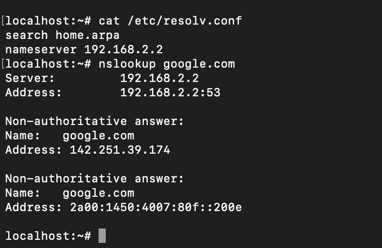

Services>DNS Resolver

1. pfSense intègre un résolveur DNS :
   Centralisation des requêtes,
   Cache DNS (plus rapide),
   Contrôle des requêtes,
   Filtrage possible,
   Journalisation

2. Cela signifie :

   Internet fonctionne
   La résolution de nom ne fonctionne pas
   Donc :
   Problème DNS
   Mauvaise config DNS
   Service DNS désactivé

## Partie 4 – Autoriser l’accès Internet

### 6. Règles de pare-feu

1. LAN net

2. any

3. Pour un accès Internet simple :
   Oui → IPv4 \* (any protocol)
   Sinon plus sécurisé :
   Autoriser HTTP (80)
   HTTPS (443)
   DNS (53)
   ICMP
   Mais en TP on autorise généralement tout.

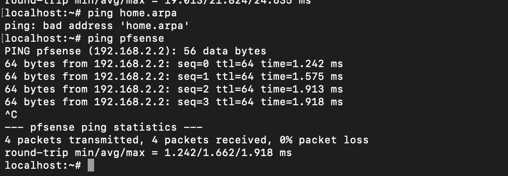
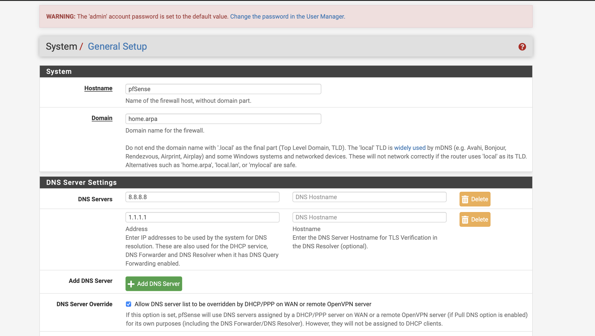

### 7. NAT

1. Le NAT (Network Address Translation) est obligatoire car notre interface WAN utilise une IP privée (192.168.11.7) fournie par UTM (Shared Network NAT).

text
LAN Alpine : 192.168.2.x (privée)
↓ NAT pfSense
WAN pfSense : 192.168.11.7 (privée)
↓ NAT UTM Mac
Internet public

Sans NAT pfSense → Alpine envoie paquets src=192.168.2.x → UTM rejette (IP privée non routable Internet).

2. | Automatique docs.netgate​                            | Manuel docs.netgate​   |
   | ---------------------------------------------------- | ---------------------- |
   | pfSense génère règles automatiquement pour tous LANs | Toi crées chaque règle |
   | Par défaut (AOT)                                     | Contrôle total         |
   | Ajout LAN = NAT auto                                 | Oubli = pas Internet   |
   | Simple (TP)                                          | Complexe (prod)        |

3. Vérifier la table NAT du routeur (ex : show ip nat translations)s
   Comparer IP locale et IP publique vue sur Internet
   Observer le trafic avec Wireshark

la j'ai ping mon dns avec sont nom de domain

ping 192.168.2.2 / ping pfsense

## Partie 5 – Filtrage

### 8. Blocage d’un site spécifique

Firewall>Aliases>add

voici tout ma configuration

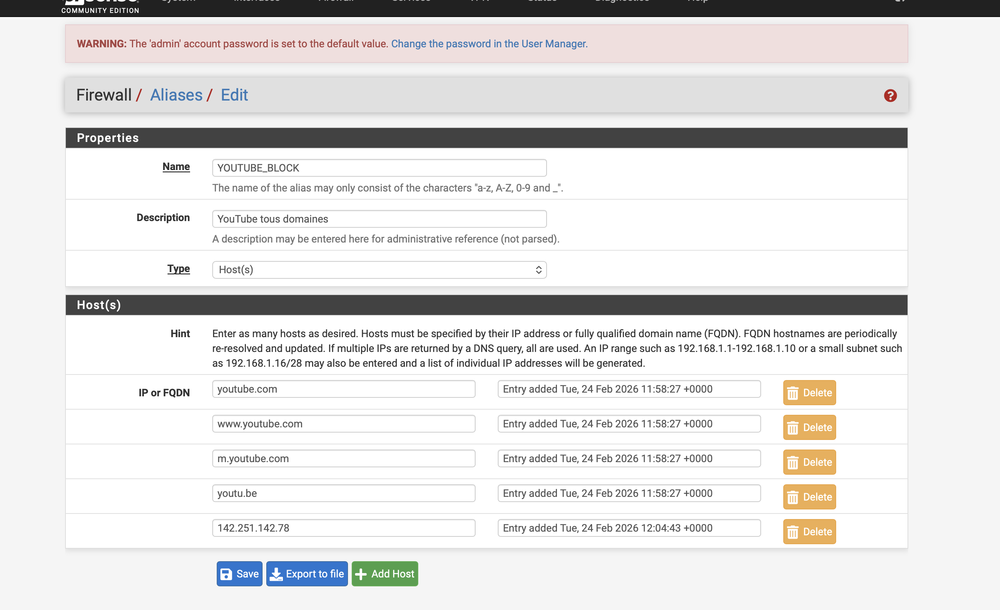
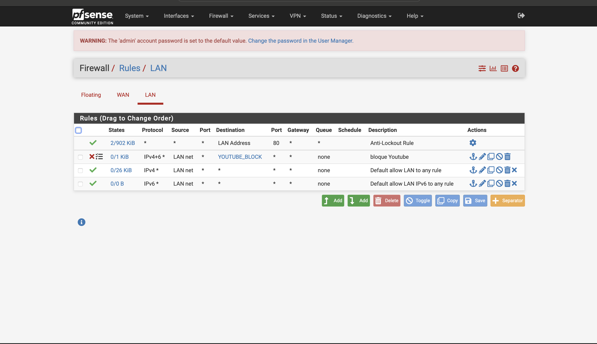
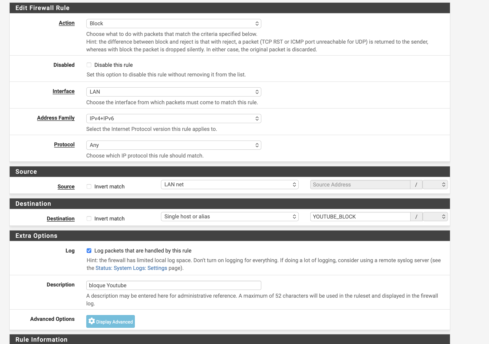

on met tout les nom de domain / ip pour bloquer le site souhaiter dans nos alias ensuite on l'ajoute dans nos rules avec les bon parametre pour que cela fonctionne puis si tout est bien fait les ping / communication ne passeront plus et seront bloquer

1.  Par nom de domaine (alias FQDN) est préférable :

IP : Statique, YouTube change IPs, CDN multiples → incomplet

Domaine : pfSense résout dynamiquement → complet + maintenable

Exemple YouTube :

text
Alias YOUTUBE_BLOCK :
→ youtube.com (172.217.22.78)
→ googlevideo.com (CDN vidéo)
→ ytimg.com (images)
→ Règle BLOCK = TOUS IPs YouTube

2. HTTPS bloqué AUSSI (même mécanisme) :

text
Navigateur → DNS youtube.com → 172.217.22.78
HTTPS TCP 443 → 172.217.22.78:443
↓ Règle BLOCK destination YOUTUBE_BLOCK
→ TCP RST/Timeout (connexion refusée)
Utilisateur voit : "Site inaccessible" ou timeout

3.  1️⃣ CDN multiples : youtube.com = 1000+ IPs différentes
    2️⃣ IP dynamique : Google change IPs régulièrement
    3️⃣ Bypass DNS : Utilisateur met IP directe (172.217.22.78)
    4️⃣ Mobile apps : youtube.exe → IPs hardcodées
    Solution alias domaine = résout toutes IPs dynamiquement.

### 9. Blocage d’une catégorie de sites (jeux d’argent)

1. Pourquoi ne pas créer une règle par site ?

Non maintenable : 10 sites = 10 règles → ajout/suppression = 10 modifs

Règles encombrées : Interface web illisible

Performance : Plus de règles = CPU + RAM

Alias = 1 règle pour N sites → évolutif

2. Où se créent les alias ?

Firewall → Aliases → Add → Menu dédié, résolution dynamique.

Comment vérifier qu'une règle bloque réellement ?
Status → System Logs → Firewall : filtre Destination = alias

tcpdump console pfSense : trafic bloqué

Test Alpine : DNS OK → ping IP timeout

3. Comment vérifier qu’une règle bloque réellement le trafic

on peut faire des ping si le ping est bloquer que l'on a pas de réponce c'est que cela fonctionne on peut aussi faire des recherche sur google qui cela ne fonctionne pas c'est que c'est bloque ou regarder dans les logs si le parametre a étais activer pour voir si on recupere bien le logs du blocage

sur cette alias on voit bien que c'est generale que cela regroupe plusieurs domain different

voici les logs

Status → System Logs → Firewall

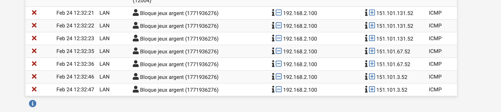

## Partie 6 – Aller plus loin (partie plus tendue)

### 10. Blocage par catégorie (réseaux sociaux)

1. si on met le parametre "Pass Any" = Règle IGNORÉE le blockage est ignorée donc la communication que l'on voulais bloquer et accessible.

voici les logs qui prouve le bloquage des réseaux sociaux (le ping vers x.com)

### 11. Règles horaires

1. on peut utiliser un systeme d'horaire pour débloquer certain site durant les pause ou des evenment ou autre. ou pour juste plus de securiter/ rajouter des regle de securiter.

Firewall → Schedules → Add

j'ai configure un horaire de 12h - 14h tout les jours sauf le samedi dimanche.

Firewall → Rules → LAN → Édite ta règle YOUTUBE_BLOCK

ensuite on edit notre blockage , on vas dans les parametre avancer et on link notre horaire avec sont nom

et comme on peut voir sur ce screen on a bien une pause de cette rules qui suit notre horaire

### 12. Serveur web local

configuration / installation simple apache2 sur alpine linux

ensuite apres ca on config la rules qui elle ne bloque pas compare a tout celle fait jusqu'a présent elle est en mode pass

ensuite apres avoir appliquer les changement depuis notre machine (ici macos) on peut soir curl l'addresse ip ou directement la chercher sur chrome safari

on a réussi

1. Filtrer par IP source ?
   OUI → Autorise UNIQUEMENT ton Mac (192.168.2.10) vers serveur Alpine.

✅ Source : 192.168.2.10 (Mac) → Alpine:80 = PASS

❌ Source : 192.168.2.x (autres VMs) → Alpine:80 = BLOCK
Principe : Accès granulaire → segmentation réseau interne.

2. Filtrer par port ?
   OUI → Autorise TCP 80 (HTTP) UNIQUEMENT.

✅ TCP 80 → Alpine = OK (web)

❌ TCP 22 → Alpine = BLOCK (SSH)

❌ TCP 443 → Alpine = BLOCK (HTTPS)

Principe : Service précis → pas d'accès SSH/FTP accidentel.

3. Pourquoi le pare-feu protège-t-il le LAN même en réseau interne ?

   1️⃣ DEFAULT DENY : Rien autorisé → Explicit allow
   seulement

   2️⃣ PROTECTION LATÉRALE : VM Alpine compromise → isolée

   3️⃣ SEGMENTATION : Serveur ≠ Clients (Zero Trust interne)

   4️⃣ LOGS/AUDIT : Qui accède à quoi ? (conformité)

   5️⃣ ANTI-SPOOFING : Empêche trafic source falsifié

### 13. Logs et analyse

j'ai deja activer le parametre des recuperation des logs dans tout les regles fait jusqua présent j'ai juste a aller les voir ici :

Status → System Logs → Firewall

1. | Paquet BLOQUÉ 🔴 docs.netgate​               | Paquet AUTORISÉ 🟢               |
   | -------------------------------------------- | -------------------------------- |
   | TCP RST ou ICMP unreachable envoyé au client | Paquet forwardé vers destination |
   | Client : "Connection refused" / Timeout      | Client : Connexion OK            |
   | Déclenché par : Règle BLOCK ou Default deny  | Déclenché par : Règle PASS       |
   | Exemple : Alpine → youtube.com               | Exemple : Mac → Alpine:80        |

2. Interface web :

Status → System Logs → Firewall
→ Clique icône 🔴 → Popup affiche :

- Rule ID : 1000000134
- **Label** : "YOUTUBE_BLOCK" ← TA RÈGLE !
- Tracker ID : Identifiant session
  Console :

clog /var/log/filter.log | grep block

Ou : pfctl -vvsr | grep YOUTUBE_BLOCK

3. comprendre le sens

Interface = LAN → **Entrant** interface LAN (du réseau vers pfSense)
►LAN → **Sortant** interface LAN (de pfSense vers réseau)

Source → Destination = Direction réelle :

- 192.168.2.10 → 172.217.22.78 = **Mac → YouTube**
- 192.168.2.50 → 192.168.2.10 = **Alpine → Mac**
  Exemple log complet :

text
🟢 LAN pass in 192.168.2.10:xxxxx → 192.168.2.50:80 "Mac→ServeurWeb"
🔴 LAN block in 192.168.2.51:xxxxx → 172.217.22.78 "YOUTUBE_BLOCK"

### 14. DMZ

1. Zone démilitarisée = sous-réseau isolé entre LAN privé (confiance) et Internet (non fiable), contenant serveurs publics (web, mail, FTP).

Serveur web entreprise accessible Internet → placé DMZ

Internet ←→ DMZ (serveurs exposés) ←→ LAN (privé)

↑Firewall↑ ↑Firewall↑ (règles strictes)

2. 1️⃣ CONTENIR compromission : Serveur hacké → LAN protégé

   2️⃣ SEGMENTATION : Serveur ≠ Clients internes (Zero Trust)

   3️⃣ SERVICES publics : Web/mail exposés Internet → Risque élevé

   4️⃣ PROTECTION latérale : DMZ ne communique PAS avec LAN

   Si serveur web compromis → Attaquant bloqué par règle DMZ → LAN = BLOCK.

3. NON → Règle BLOCK DMZ → LAN net obligatoire.
   VM DMZ 192.168.100.10 → ping 192.168.2.2 (LAN) = BLOCK ✓
   DMZ → LAN = ISOLÉ (sécurité critique)

4. NON → Default deny + règles explicites seulement.

   ❌ LAN net (192.168.2.0/24) → DMZ net = BLOCK (default deny)

   ✅ Mac admin (192.168.2.10) → DMZ:80 = PASS (règle précise)

