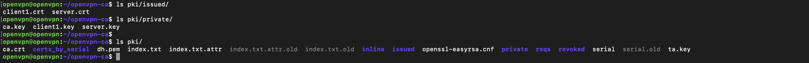

# TP -- Mise en place d'un serveur OpenVPN sur Ubuntu Server

**Objectif : Créer un serveur VPN OpenVPN sur Ubuntu Server avec certificats, NAT et client fonctionnel**

- VM Ubuntu Server 24.04 LTS (1 CPU, 2Go RAM)
- Réseau NAT (1 interface réseau)
- Accès SSH depuis ton Mac

# Étape 0 : Installation Ubuntu Server

1. Langue → Français
2. Clavier → Français
3. Réseau → DHCP automatique
4. Ubuntu Pro → "Continuer sans"
5. Disque → "Utiliser un disque entier"
6. Utilisateur → openvpn / [ton mot de passe]
7. ✅ COCHE "Serveur SSH OpenSSH" ← IMPORTANT !
8. Continuer → Attendre 10min → Reboot

## Partie 1 + 2

2.1 Créer environnement PKI

    make-cadir ~/openvpn-ca
    cd ~/openvpn-ca

2.2 Configurer tes infos (comme une carte d'identité)

    nano vars

    export KEY_COUNTRY="FR"
    export KEY_PROVINCE="Nouvelle-Aquitaine"
    export KEY_CITY="Le Bouscat"
    export KEY_ORG="MonLab"
    export KEY_EMAIL="toi@email.com"
    export KEY_CN="MonCA"

2.3 Générer la CA (Autorité de Certification = "passeport des certificats")

    ./easyrsa init-pki
    ./easyrsa build-ca nopass

2.4 Certificat SERVEUR

    ./easyrsa gen-req server nopass
    # Common Name → "server"
    ./easyrsa sign-req server server
    # yes

2.5 Certificat CLIENT

    ./easyrsa gen-req client1 nopass
    # Common Name → "client1"
    ./easyrsa sign-req client client1
    # yes

2.6 Clés de chiffrement

    ./easyrsa gen-dh          # Diffie-Hellman (2048 bits)
    openvpn --genkey secret pki/ta.key  # TLS Auth (anti-DDoS)

**_Verification_**

    >> cat server.ct

    Certificate:
    Data:
        Version: 3 (0x2)
        Serial Number:
            64:e4:e3:62:bb:70:4a:6a:b7:87:21:93:36:70:58:4e
        Signature Algorithm: sha256WithRSAEncryption
        Issuer: CN=MonCA
        Validity
            Not Before: Feb 26 11:03:36 2026 GMT
            Not After : May 31 11:03:36 2028 GMT
        Subject: CN=server
        Subject Public Key Info:
            Public Key Algorithm: rsaEncryption
                Public-Key: (2048 bit)
                Modulus:
                    00:c2:ac:89:76:ce:0f:28:28:e6:62:e0:25:56:23:
                    48:b1:e1:35:26:2a:1a:a8:62:fb:63:37:74:45:e0:
                    12:de:97:69:8b:f1:fe:51:9b:e3:f2:00:36:22:b0:
                    56:35:88:df:12:f5:e0:fa:b1:9b:0d:bb:50:ac:ba:
                    a7:95:b3:83:d2:ff:f5:29:2b:6d:16:d1:c3:55:bb:
                    5d:21:9b:f2:11:c9:69:8a:f9:c1:31:6d:62:e5:4e:
                    02:b3:86:52:8f:e6:3e:a2:cc:23:d4:e2:b9:de:a3:
                    75:be:45:e8:bd:04:f5:4e:ff:6b:01:6f:47:32:2d:
                    9b:aa:a9:26:ed:ef:96:db:a5:f4:8b:e6:8f:c7:b8:
                    82:e5:c1:57:af:f7:ad:bc:09:c0:16:76:d4:c7:55:
                    0e:ab:8b:df:e0:42:84:68:1c:ab:53:da:75:2a:78:
                    97:46:85:52:66:f5:b2:8f:87:f5:7e:db:3e:88:b1:
                    47:71:2b:ba:ee:e6:e0:4e:ca:db:80:ed:e6:68:7e:
                    12:a6:ba:5b:53:69:dc:d7:85:3e:10:4a:2c:11:15:
                    26:bd:d5:fd:3f:8a:76:12:b1:aa:dc:68:0b:36:f3:
                    ba:1d:57:0e:be:ab:2f:d2:ba:e4:26:35:13:5f:8d:
                    da:7d:fd:23:d8:09:fd:e1:89:75:31:c3:6f:1d:b5:
                    36:cd
                Exponent: 65537 (0x10001)
        X509v3 extensions:
            X509v3 Basic Constraints:
                CA:FALSE
            X509v3 Subject Key Identifier:
                E7:3C:A4:D5:32:E7:A8:18:FB:68:26:AE:98:DF:CB:A6:21:4D:D2:8D
            X509v3 Authority Key Identifier:
                keyid:D7:F9:10:18:52:60:14:2F:4E:CD:0C:F3:C8:0C:98:A3:14:61:C6:13
                DirName:/CN=MonCA
                serial:02:B2:34:92:9E:80:A3:8E:2F:67:41:13:24:F5:B9:B6:8C:5E:2D:91
            X509v3 Extended Key Usage:
                TLS Web Server Authentication
            X509v3 Key Usage:
                Digital Signature, Key Encipherment
            X509v3 Subject Alternative Name:
                DNS:server
    Signature Algorithm: sha256WithRSAEncryption
    Signature Value:
        9d:95:23:c1:d4:bd:e7:8a:7b:87:f8:90:1f:b3:43:45:06:07:
        8a:ea:ae:fa:ac:dc:11:d9:f6:90:d4:f6:9a:1a:78:2c:f4:e0:
        ee:32:a4:ab:68:ac:59:2b:11:46:93:55:5e:22:19:2b:36:3c:
        ea:c2:b8:68:d2:a8:cf:79:08:ae:70:b9:99:0a:f1:ef:ae:2f:
        de:e3:b2:a9:e1:08:bd:72:9e:b7:51:7d:a2:a4:57:f5:4d:04:
        c5:bf:27:f7:74:2b:34:28:33:60:c7:f2:d3:fb:4b:8b:f3:c3:
        2d:4c:c4:84:7f:cc:53:57:28:b0:3f:50:d0:56:e6:e4:93:99:
        7d:52:96:d8:27:7f:06:dc:86:60:3f:a7:79:5b:df:c7:cb:c4:
        bc:3c:44:ab:3f:bd:4e:b3:3f:ff:43:eb:94:4b:38:9e:9d:12:
        98:33:ac:81:b1:9d:d4:1a:f0:73:09:fa:7e:d0:74:74:7f:53:
        13:6f:25:26:a5:81:83:c8:ff:c6:b2:f3:77:ae:8d:c9:d3:4b:
        85:9b:ca:04:b2:e7:ed:e7:0b:30:3a:21:17:d1:b1:2b:b1:66:
        8c:75:50:93:fc:26:d0:f2:6b:df:80:2f:91:c3:f6:32:9d:e3:
        0a:6a:02:b5:d6:35:67:58:b1:66:9a:eb:30:13:7f:4c:19:2e:
        07:97:67:33

        -----BEGIN CERTIFICATE-----
        MIIDWzCCAkOgAwIBAgIQZOTjYrtwSmq3hyGTNnBYTjANBgkqhkiG9w0BAQsFADAQ
        MQ4wDAYDVQQDDAVNb25DQTAeFw0yNjAyMjYxMTAzMzZaFw0yODA1MzExMTAzMzZa
        MBExDzANBgNVBAMMBnNlcnZlcjCCASIwDQYJKoZIhvcNAQEBBQADggEPADCCAQoC
        ggEBAMKsiXbODygo5mLgJVYjSLHhNSYqGqhi+2M3dEXgEt6XaYvx/lGb4/IANiKw
        VjWI3xL14Pqxmw27UKy6p5Wzg9L/9SkrbRbRw1W7XSGb8hHJaYr5wTFtYuVOArOG
        Uo/mPqLMI9Tiud6jdb5F6L0E9U7/awFvRzItm6qpJu3vltul9Ivmj8e4guXBV6/3
        rbwJwBZ21MdVDquL3+BChGgcq1PadSp4l0aFUmb1so+H9X7bPoixR3Eruu7m4E7K
        24Dt5mh+Eqa6W1Np3NeFPhBKLBEVJr3V/T+KdhKxqtxoCzbzuh1XDr6rL9K65CY1
        E1+N2n39I9gJ/eGJdTHDbx21Ns0CAwEAAaOBrzCBrDAJBgNVHRMEAjAAMB0GA1Ud
        DgQWBBTnPKTVMueoGPtoJq6Y38umIU3SjTBLBgNVHSMERDBCgBTX+RAYUmAUL07N
        DPPIDJijFGHGE6EUpBIwEDEOMAwGA1UEAwwFTW9uQ0GCFAKyNJKegKOOL2dBEyT1
        ubaMXi2RMBMGA1UdJQQMMAoGCCsGAQUFBwMBMAsGA1UdDwQEAwIFoDARBgNVHREE
        CjAIggZzZXJ2ZXIwDQYJKoZIhvcNAQELBQADggEBAJ2VI8HUveeKe4f4kB+zQ0UG
        B4rqrvqs3BHZ9pDU9poaeCz04O4ypKtorFkrEUaTVV4iGSs2POrCuGjSqM95CK5w
        uZkK8e+uL97jsqnhCL1ynrdRfaKkV/VNBMW/J/d0KzQoM2DH8tP7S4vzwy1MxIR/
        zFNXKLA/UNBW5uSTmX1SltgnfwbchmA/p3lb38fLxLw8RKs/vU6zP/9D65RLOJ6d
        EpgzrIGxndQa8HMJ+n7QdHR/UxNvJSalgYPI/8ay83eujcnTS4WbygSy5+3nCzA6
        IRfRsSuxZox1UJP8JtDya9+AL5HD9jKd4wpqArXWNWdYsWaa6zATf0wZLgeXZzM=
        -----END CERTIFICATE-----

---

    >> cat client1.ct

    Certificate:
    Data:
        Version: 3 (0x2)
        Serial Number:
            ab:d5:68:da:34:5c:84:19:87:af:24:54:b6:23:d5:eb
        Signature Algorithm: sha256WithRSAEncryption
        Issuer: CN=MonCA
        Validity
            Not Before: Feb 26 11:04:14 2026 GMT
            Not After : May 31 11:04:14 2028 GMT
        Subject: CN=client1
        Subject Public Key Info:
            Public Key Algorithm: rsaEncryption
                Public-Key: (2048 bit)
                Modulus:
                    00:b2:f1:7e:8f:a1:83:17:70:1d:97:a3:b9:f7:a3:
                    36:22:5d:65:b0:05:cc:7f:20:95:c7:db:16:26:c6:
                    ce:fc:20:10:1c:2f:18:55:90:ae:e1:e9:4f:b0:89:
                    15:56:a3:d3:0f:cd:66:55:76:cc:ea:45:b4:98:e9:
                    48:a9:c4:5c:ea:c0:48:e1:81:bd:35:3e:50:a3:9e:
                    5c:b3:10:bd:ce:f8:b1:fa:87:fb:8f:84:5e:4d:63:
                    d5:08:54:b7:51:6f:a1:22:49:23:40:be:a3:66:7c:
                    d4:1b:fd:ee:11:07:58:8d:f1:b4:f9:fa:9b:bd:40:
                    4c:0a:d2:30:9d:de:78:5b:aa:3f:ff:81:fd:52:06:
                    3c:77:d8:a6:39:c4:04:15:6f:74:b0:e9:14:c7:cf:
                    d5:cb:87:9f:68:2e:85:00:d3:47:15:b0:89:a6:6e:
                    b9:4e:f7:da:79:18:4e:59:a6:6c:95:8a:a3:b0:39:
                    46:c3:a4:0a:9a:cf:78:80:a0:eb:f7:d2:71:7c:90:
                    fa:6a:67:1b:64:86:4a:38:04:d6:47:f1:6c:84:b7:
                    02:09:5f:b4:4d:0b:27:86:2f:82:4b:f7:60:e3:40:
                    e9:7e:c3:40:f8:ae:a3:d9:89:13:4b:c1:03:4e:c8:
                    3a:f6:fb:14:bc:93:38:6f:9e:5c:58:0e:fb:7d:77:
                    e8:25
                Exponent: 65537 (0x10001)
        X509v3 extensions:
            X509v3 Basic Constraints:
                CA:FALSE
            X509v3 Subject Key Identifier:
                6C:64:D3:CA:C5:D3:FF:7A:02:89:D4:03:44:22:01:8B:D9:13:BB:08
            X509v3 Authority Key Identifier:
                keyid:D7:F9:10:18:52:60:14:2F:4E:CD:0C:F3:C8:0C:98:A3:14:61:C6:13
                DirName:/CN=MonCA
                serial:02:B2:34:92:9E:80:A3:8E:2F:67:41:13:24:F5:B9:B6:8C:5E:2D:91
            X509v3 Extended Key Usage:
                TLS Web Client Authentication
            X509v3 Key Usage:
                Digital Signature
    Signature Algorithm: sha256WithRSAEncryption
    Signature Value:
        a6:39:fa:29:d4:99:36:4e:b6:a1:10:31:c3:30:34:4c:17:c4:
        4f:9b:5b:ab:7e:a6:29:e9:ff:b9:1b:40:5a:77:c3:25:3d:f0:
        59:3c:7a:ed:49:89:64:3e:42:69:17:72:f4:2d:01:4b:de:98:
        04:ff:34:30:3d:cf:10:a4:ec:03:81:73:53:cf:ec:b5:b0:47:
        fe:ea:9d:53:c2:ad:a8:99:28:90:c7:9a:0e:bf:e4:1e:ad:71:
        ad:9f:d7:74:cd:11:dc:6b:b9:65:9a:58:fc:54:d4:be:53:4b:
        c7:12:0f:fe:db:59:4f:6c:65:3c:bb:28:1f:22:2b:b7:57:8c:
        8e:5a:c4:3c:b6:6a:f7:bb:ff:b9:3c:f8:5f:e9:4d:7d:de:47:
        a3:0c:83:0d:f9:29:b8:39:90:50:2d:8f:a5:c1:6b:36:bc:92:
        96:bb:e4:69:3e:f6:8d:5a:c4:b0:a8:52:6c:a1:20:07:e9:80:
        d1:26:0c:1d:70:3c:ff:82:53:89:0e:d9:6f:65:b3:67:4d:40:
        5a:8c:61:3c:61:34:49:1d:29:66:70:b3:cf:50:32:f9:03:70:
        b2:20:40:40:23:56:5b:b8:19:81:ff:25:51:92:b0:f3:a2:e2:
        d0:39:94:bb:fc:02:fd:b5:ea:55:d8:14:be:70:31:b2:b2:dd:
        24:1d:61:ef

        -----BEGIN CERTIFICATE-----
        MIIDSjCCAjKgAwIBAgIRAKvVaNo0XIQZh68kVLYj1eswDQYJKoZIhvcNAQELBQAw
        EDEOMAwGA1UEAwwFTW9uQ0EwHhcNMjYwMjI2MTEwNDE0WhcNMjgwNTMxMTEwNDE0
        WjASMRAwDgYDVQQDDAdjbGllbnQxMIIBIjANBgkqhkiG9w0BAQEFAAOCAQ8AMIIB
        CgKCAQEAsvF+j6GDF3Adl6O596M2Il1lsAXMfyCVx9sWJsbO/CAQHC8YVZCu4elP
        sIkVVqPTD81mVXbM6kW0mOlIqcRc6sBI4YG9NT5Qo55csxC9zvix+of7j4ReTWPV
        CFS3UW+hIkkjQL6jZnzUG/3uEQdYjfG0+fqbvUBMCtIwnd54W6o//4H9UgY8d9im
        OcQEFW90sOkUx8/Vy4efaC6FANNHFbCJpm65TvfaeRhOWaZslYqjsDlGw6QKms94
        gKDr99JxfJD6amcbZIZKOATWR/FshLcCCV+0TQsnhi+CS/dg40DpfsNA+K6j2YkT
        S8EDTsg69vsUvJM4b55cWA77fXfoJQIDAQABo4GcMIGZMAkGA1UdEwQCMAAwHQYD
        VR0OBBYEFGxk08rF0/96AonUA0QiAYvZE7sIMEsGA1UdIwREMEKAFNf5EBhSYBQv
        Ts0M88gMmKMUYcYToRSkEjAQMQ4wDAYDVQQDDAVNb25DQYIUArI0kp6Ao44vZ0ET
        JPW5toxeLZEwEwYDVR0lBAwwCgYIKwYBBQUHAwIwCwYDVR0PBAQDAgeAMA0GCSqG
        SIb3DQEBCwUAA4IBAQCmOfop1Jk2TrahEDHDMDRMF8RPm1urfqYp6f+5G0Bad8Ml
        PfBZPHrtSYlkPkJpF3L0LQFL3pgE/zQwPc8QpOwDgXNTz+y1sEf+6p1Twq2omSiQ
        x5oOv+QerXGtn9d0zRHca7llmlj8VNS+U0vHEg/+21lPbGU8uygfIiu3V4yOWsQ8
        tmr3u/+5PPhf6U193kejDIMN+Sm4OZBQLY+lwWs2vJKWu+RpPvaNWsSwqFJsoSAH
        6YDRJgwdcDz/glOJDtlvZbNnTUBajGE8YTRJHSlmcLPPUDL5A3CyIEBAI1ZbuBmB
        /yVRkrDzouLQOZS7/AL9tepV2BS+cDGyst0kHWHv
        -----END CERTIFICATE-----

2.8 Copier vers OpenVPN

    sudo mkdir -p /etc/openvpn/server
    sudo cp pki/ca.crt pki/issued/server.crt pki/private/server.key pki/dh.pem pki/ta.key /etc/openvpn/server/

### Questions 1

1. À quoi sert une autorité de certification (CA) ?

   Une CA est une entité de confiance qui valide l'identité des utilisateurs/serveurs et signe numériquement leurs certificats publics. Elle établit une chaîne de confiance : un client fait confiance à la CA, donc il fait confiance aux certificats qu'elle signe.

2. Quelle différence entre clé privée et certificat ?

   Clé privée : Secrète, jamais partagée. Sert à signer et déchiffrer.

   Certificat : Public (contient clé publique + identité). Signé par la CA pour prouver son authenticité.

3. Pourquoi un serveur VPN a-t-il besoin de certificats ?

   Authentification mutuelle (serveur ↔ client) + chiffrement TLS du tunnel. Empêche les MITM (man-in-the-middle).

4. Où Easy-RSA crée-t-il ses fichiers ?

   Dans ~/openvpn-ca/pki/ (dossier principal PKI).

5. Que contient le dossier pki/ ?

   ca.crt / ca.key : Autorité de certification

   issued/ : Certificats signés (server.crt, client1.crt)

   private/ : Clés privées (server.key, client1.key, ca.key)

   dh.pem : Paramètres Diffie-Hellman

   ta.key : Clé TLS symétrique

6. Différence entre gen-req et sign-req ?

   gen-req : Génère une requête de certificat (CSR) + clé privée

   sign-req : Signe la CSR avec la CA → certificat valide

7. Que se passe-t-il si vous oubliez de signer un certificat ?

   Le certificat est inutilisable. Le serveur/client refuse la connexion (pas de confiance établie).

### Questions 2

1. Que signifie dev tun ?

   Crée une interface réseau TUN (niveau IP, routage layer 3). Plus léger que TAP (niveau Ethernet, bridge layer 2).

2. Différence entre UDP et TCP pour un VPN ?

   UDP : Plus rapide, pas de retransmission (idéal VPN). Sensible aux pertes de paquets.

   TCP : Fiable (retransmission), mais overhead + latence. Utile derrière firewalls bloquant UDP.

3. Quelle plage IP choisir pour le VPN ? Pourquoi ?
   10.8.0.0/24 car :

   RFC 1918 (plage privée)

   Ne chevauche pas ton réseau local 192.168.11.0/24

   server 10.8.0.0 255.255.255.0 = serveur prend 10.8.0.1, clients 10.8.0.2-254

4. Où se configure ip_forward ?

   /etc/sysctl.conf (net.ipv4.ip_forward=1) ou /proc/sys/net/ipv4/ip_forward.

5. Commande règles NAT ?

   sudo iptables -t nat -L -v -n ou sudo iptables-save.

6. Pourquoi "masquerader" le réseau VPN ?

   Les clients VPN (10.8.0.x) n'ont pas d'IP publique. NAT MASQUERADE fait sortir leur trafic via l'IP publique du serveur (192.168.11.8 → Internet).

7. Logs service ?

   sudo journalctl -u openvpn-server@server -f (suivi temps réel).

8. status vs journalctl ?

   status : Aperçu rapide (état, PID, dernières lignes)

   journalctl : Logs complets, filtrables, historiques.

## Partie 3 : Création du profil client

3.1 Fichier de configuration

    sudo nano /etc/openvpn/server/server.conf

    port 1194
    proto udp
    dev tun
    ca /etc/openvpn/server/ca.crt
    cert /etc/openvpn/server/server.crt
    key /etc/openvpn/server/server.key
    dh /etc/openvpn/server/dh.pem
    tls-auth /etc/openvpn/server/ta.key 0
    server 10.8.0.0 255.255.255.0
    push "redirect-gateway def1"
    push "dhcp-option DNS 8.8.8.8"
    keepalive 10 120
    cipher AES-256-GCM
    user nobody
    group nogroup
    persist-tun
    verb 3

3.2 Activer le routage (IMPORTANT)

    sudo nano /etc/sysctl.conf

    net.ipv4.ip_forward=1

    ---

    sudo sysctl -p

3.3 NAT (Internet pour clients VPN)

    sudo iptables -t nat -A POSTROUTING -s 10.8.0.0/24 -o enp0s1 -j MASQUERADE

    sudo netfilter-persistent save

3.4 Démarrer !

    sudo systemctl enable openvpn-server@server
    sudo systemctl start openvpn-server@server
    sudo systemctl status openvpn-server@server

4.1 Créer profil client

    cd ~/openvpn-ca
    nano client1.ovpn

    client
    dev tun
    proto udp
    remote 192.168.11.8 1194 # TON IP VM
    resolv-retry infinite
    nobind
    persist-key
    persist-tun
    remote-cert-tls server
    tls-auth ta.key 1
    cipher AES-256-GCM
    verb 3
    <ca>

4.2 Intégrer certificats AUTOMATIQUE

    cat pki/ca.crt >> client1.ovpn
    echo "</ca>" >> client1.ovpn
    echo "<cert>" >> client1.ovpn
    cat pki/issued/client1.crt >> client1.ovpn
    echo "</cert>" >> client1.ovpn
    echo "<key>" >> client1.ovpn
    cat pki/private/client1.key >> client1.ovpn
    echo "</key>" >> client1.ovpn
    echo "<tls-auth>" >> client1.ovpn

    cat pki/ta.key >> client1.ovpn
    echo "</tls-auth>" >> client1.ovpn

4.3 Vérifier le fichier

    tail -15 client1.ovpn

Doit finir par :

    -----END OpenVPN Static key V1-----
    </tls-auth>

4.4 Transférer sur ton Ordinateur

ouvrire un terminale

    scp openvpn@192.168.11.8:~/openvpn-ca/client1.ovpn ~/Desktop/

4.5 Installer OpenVPN

    brew install openvpn

4.6 TESTER LA CONNEXION !

    cd ~/Desktop
    sudo openvpn --config client1.ovpn

### Question

1. Comment intégrer un certificat directement dans un fichier .ovpn ?

   Les certificats s'intègrent entre des balises PEM spécifiques :

   <ca>

   -----BEGIN CERTIFICATE-----

   [contenu ca.crt]

   -----END CERTIFICATE-----

   </ca>

   <cert>

2. Pourquoi la clé privée ne doit-elle jamais être partagée publiquement ?

   La clé privée est l'élément secret essentiel du chiffrement asymétrique. Si elle est compromise :

   Usurpation d'identité : Un attaquant peut se faire passer pour le propriétaire légitime du certificat (client ou serveur VPN) et se connecter au VPN.

   Décryptage du trafic : Avec la clé privée + certificat correspondant, l'attaquant peut déchiffrer tout le trafic TLS/SSL passé/chiffré avec cette paire.

   Violation de l'authentification mutuelle : OpenVPN repose sur l'authentification bidirectionnelle (client ↔ serveur). Une clé privée compromise casse cette confiance.

   Exemple concret :

   Attaquant avec clé privée client1.key + client1.crt
   → Se connecte comme "client1" au serveur OpenVPN
   → Obtient IP 10.8.0.x dans ton tunnel VPN
   → Accède à Internet via ton NAT (sortie 192.168.11.8)
   C'est pourquoi :

   ca.key (CA) → Ultra-secret (jamais copié)

   server.key → Secret (/etc/openvpn/server/, chmod 600)

   client1.key → Secret par client (dans .ovpn personnel uniquement)
